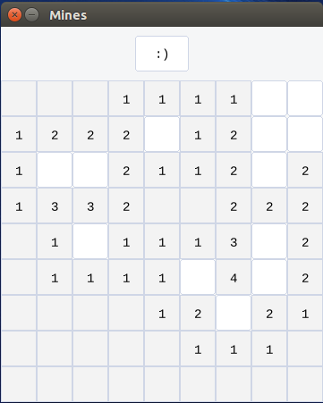

# Mines

Compatible with [Redox](https://github.com/redox-os) and SDL2 platforms.

You can play the game in 9x9 field with 10 mines, however there are missing features. To be done:

- [ ] Right click to mark cell as mine (waiting for orbtk to support it)
- [ ] Create icon for a mine
- [ ] Mark all mines when you finish the game (you can only see the reset button change from `:)` to `:D`)
- [ ] Finish implementing mine countdown (required marking mines first)
- [ ] Implement time counter
- [ ] Implement larger fields
- [ ] Make prettier UI
- [ ] Add shared scores
